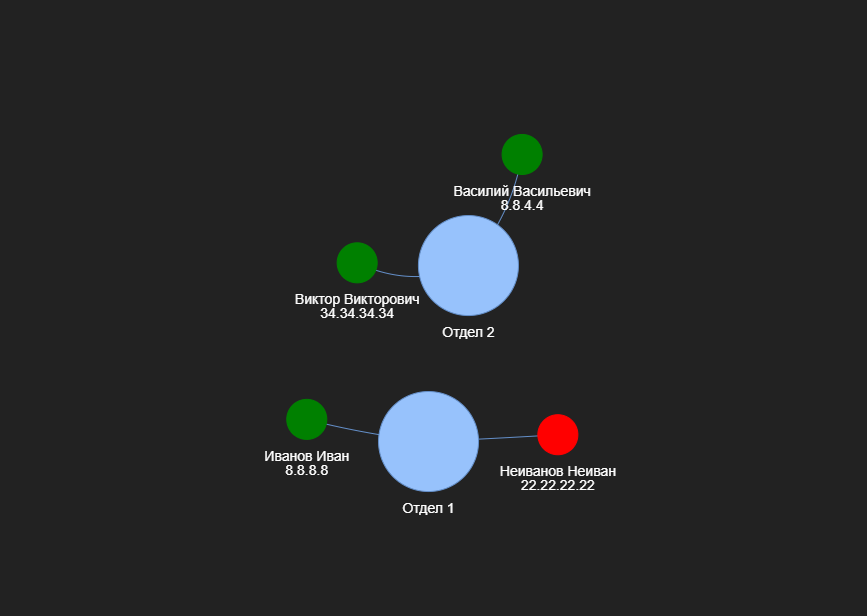

<h2>Описание</h2>

Скрипт на python для массового пинга хостов. После выполнения скрипта, появится html файл "nx.html", в котором будут отображены хоcты и отделы в виде графа. 

Отредактируйте файл с целевыми хостами "ip.json" в соответсвии с его структурой. Скрипт работает в мультипоточном режиме с помощью библиотеки threading. Если хост активен, то его вершина будет окрашена в зеленый цвет, иначе в красный.

<h2>Зависимости</h2>

Необходим python 3 версии. (тестировался на python3.8)

Установите библиотеку ping3 для пинга хоста с помощью языка python

<code>pip install ping3</code>

Необходима библиотека pyvis для построения html файла

<code>pip install pyvis</code>

Также используется мультипотоковая библиотека threading

<h2>Запуск</h2>

Заполните файл ip.json со своими хостами

Запустите скрипт ping2.py

<code>python ping2.py</code>
